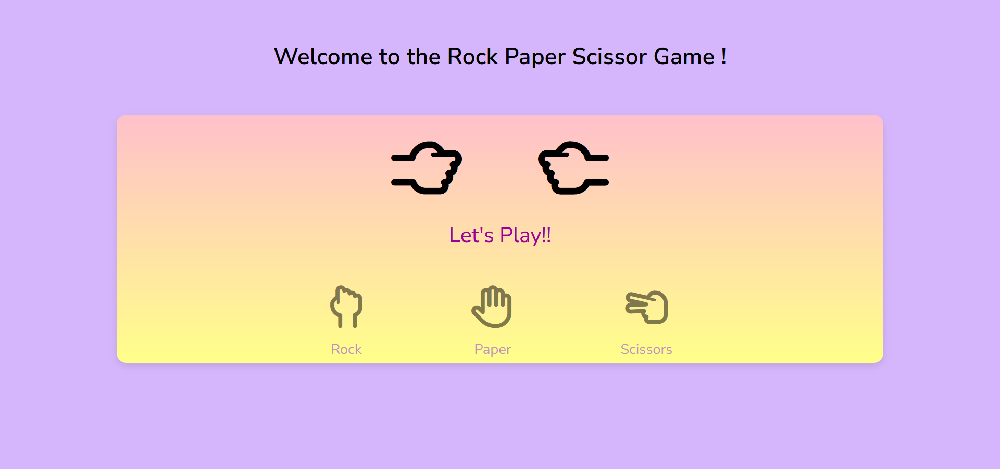

# Rock-paper-scissor game

## Introduction
Welcome to the Rock-Paper-Scissor game. This fun and interactive game allows you to challenge the computer to a quick match of Rock-Paper-Scissors.
I have developed this game using HTML, CSS and JavasScript.In this game, user have to choose among rock, paper and scissor to start his competition with the computer.
In this interactive web-based game, you'll face off against the computer, making choices between "Rock," "Paper," or "Scissors." 
Here is the screenshot of the game.


## Steps
 - ### Create Folders
   To develop this game, first create a folder and set up your HTML, CSS, and JavaScript files and link them.
- ### Basic Structure
   - ### HTML
     After setting up your files, build the foundation of the game using HTML.  For the icons of rock, paper, and scissor, you can uses images but in my codes,
     I have used font awesome icons so if you are also going to use font awesome icons don't forget to add font awesome cdn link in your head.
     All the html code is really simple and I have used <span> tag to put my icons in it. Below is the detailed code of the body for your HTML.
     ```html
     <body>
        <div class="container">
            <h1>Welcome to the Rock Paper Scissor Game !</h1>
          <main>
             <section>
                <div class="result_field">
                  <div class="result_images">
                    <span class="user_result">
                      <i class="far fa-hand-rock"></i>
                    </span>
                    <span class="computer_result">
                      <i class="far fa-hand-rock"></i>
                    </span>
                  </div>
                  <div class="result">Let's Play!!</div>
                </div>
                <div class="option_images">
                  <span class="option_image">
                    <i class="far fa-hand-rock"></i>
                    <p>Rock</p>
                  </span>
                  <span class="option_image">
                    <i class="far fa-hand"></i>
                    <p>Paper</p>
                  </span>
                  <span class="option_image">
                    <i class="far fa-hand-scissors"></i>
                    <p>Scissors</p>
                  </span>
                </div>
             </section>
           </main>
       </body>
     ```
     - ### CSS
        Use CSS to enhance the visual appeal of your game. Add animations, fonts, colors, and customize the appearance of the game elements to make it engaging and visually
       appealing according to you.
     - ### JavaScript
       The JavaScript file is the heart of the Rock-Paper-Scissors game. It's responsible for managing user interactions, generating computer choices, calculating game results,
        and creating an engaging gaming experience. Here are the some of the important codes of the javascript :
       ```javascript
       / Utility functions
           function onEvent(event, selector, callback) {
           return selector.addEventListener(event, callback);
           }

           function select(selector, parent = document) {
           return parent.querySelector(selector);
           }

         function selectAll(selector, parent = document) {
          return [...parent.querySelectorAll(selector)];
          }

         const userResult = select(".user_result i");
         const computerResult = select(".computer_result i");
         const result = select(".result");
         const optionImages = selectAll(".option_image");

         function getRandomOption(gameOptions) {
         return gameOptions[Math.floor(Math.random() * gameOptions.length)];
          }

         function updateUserResult(resultElement, choice) {
         resultElement.className = `far ${choice.icon}`;
         }

        function displayResult(resultElement, userChoice, computerChoice) {
         if (userChoice.name === computerChoice.name) {
        resultElement.textContent = "It's a tie!";
        } else if (
        (userChoice.name === "Rock" && computerChoice.name === "Scissors") ||
        (userChoice.name === "Paper" && computerChoice.name === "Rock") ||
        (userChoice.name === "Scissors" && computerChoice.name === "Paper")
        ) {
        resultElement.textContent = "You win!";
       } else {
        resultElement.textContent = "Computer wins!";
        }
        }

         function setupGame() {
         const gameOptions = [
         { name: "Rock", icon: "fa-hand-rock" },
         { name: "Paper", icon: "fa-hand" },
         { name: "Scissors", icon: "fa-hand-scissors" },
         ];

         optionImages.forEach((optionImage, index) => {
          onEvent("click", optionImage, () => {
            optionImages.forEach(image => image.classList.add("disabled"));

            const userChoice = gameOptions[index];
            const computerChoice = getRandomOption(gameOptions);

            updateUserResult(userResult, userChoice);
            updateUserResult(computerResult, computerChoice);

            setTimeout(() => {
                displayResult(result, userChoice, computerChoice);
                optionImages.forEach(image => image.classList.remove("disabled"));
            }, 500);
          });
         });
         }

       ```

## Game
 You can enjoy this game here
